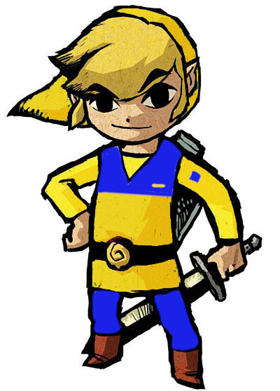

# Final_Zelda:SedexOfTime



**Número da Lista**: X<br>
**Conteúdo da Disciplina**: Final<br>

## Alunos
|Matrícula | Aluno |
| -- | -- |
| 18/0106970  |  Matheus Gabriel Alves Rodrigues |
| 18/0129287 |  Pedro Henrique Vieira Lima |

## Sobre 

Malon é a proprietária do Lon Lon Ranch e gostaria de otimizar as entregas que tem de realizar pelo reino de Hyrule e suas redondezas, para isso ela pede sua ajuda para elaborar um sistema que otimize seus lucros e também ache as melhores rotas para entrega.

## Screenshots

### Screenshot 1

<!--  -->

### Screenshot 2

<!--  -->

### Screenshot 3

<!--  -->

## Instalação 
**Linguagem**: Python e JS<br>
**Framework**: Flask e React<br>

### Backend

``` bash
cd Backend/
```

``` bash
pip install flask
```

``` bash
python main.py
```

### Frontend

``` bash
cd Frontend/
```

``` bash
npm install
```

``` bash
npm start
```
## Uso 
Explique como usar seu projeto caso haja algum passo a passo após o comando de execução.

## Outros 
Quaisquer outras informações sobre seu projeto podem ser descritas abaixo.

